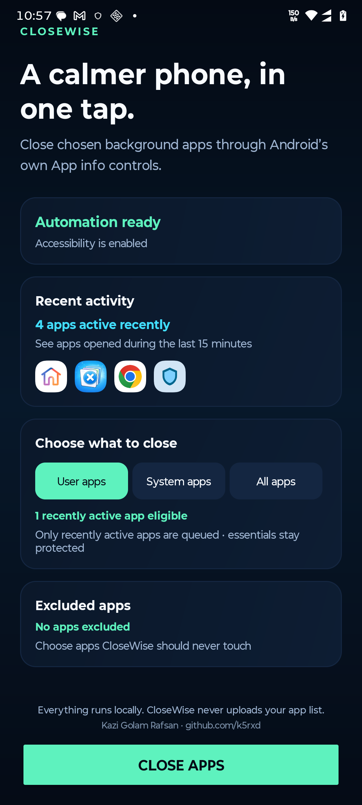
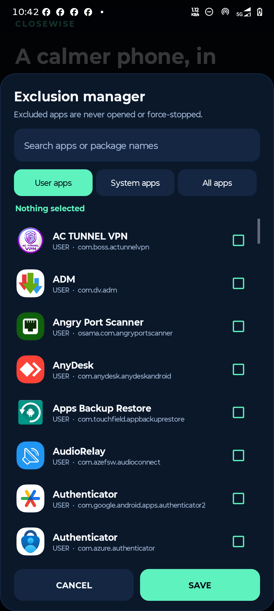
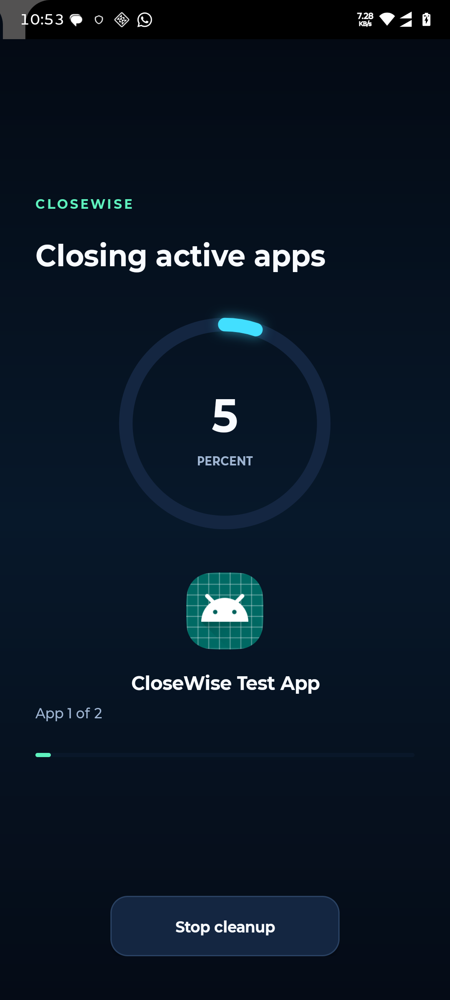
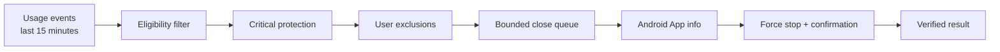

<div align="center">
  
  <h1>CloseWise</h1>
  <p><strong>A privacy-first Android app for closing recently active apps through Android's own secure controls.</strong></p>

  [](https://developer.android.com/about/versions/oreo)
  [](https://openjdk.org/projects/jdk/17/)
  [](LICENSE)
  [](PRIVACY.md)

  [Download latest release](https://github.com/k5rxd/CloseWise/releases/latest) · [Report an issue](https://github.com/k5rxd/CloseWise/issues)
</div>

## Overview

CloseWise turns Android's per-app **App info → Force stop** workflow into a controlled queue. It targets only recently active, eligible apps; protects critical components; respects a persistent exclusion list; and provides a single animated progress surface throughout the operation.

It requires no root access, Shizuku, ADB, network connection, account, analytics SDK, or remote service.

<div align="center">
  
  &nbsp;&nbsp;
  
  <br/><br/>
  
</div>

## Highlights

- Recently active app discovery using Android Usage Access
- User, system, and combined filtering from one dashboard
- Searchable exclusion manager with app icons and package names
- Trusted accessibility overlay that keeps Android Settings out of view
- Animated circular and linear progress with current app and queue position
- Immediate cancellation through a dedicated Stop control
- Automatic retry for delayed OEM Settings pages
- Per-app timeout so one package cannot block the queue
- Immediate detection and skipping of already-stopped apps
- Independent protection for Settings, System UI, launchers, keyboards, enabled accessibility services, and CloseWise itself
- Accurate checked-versus-force-stopped completion results
- Fully local operation with zero network permission

## How it works



Android does not expose a public API that lets an ordinary third-party app silently force-stop other packages. CloseWise therefore opens the official App info screen and uses an explicitly enabled accessibility service to activate **Force stop** and its confirmation. A trusted accessibility overlay presents the entire operation as one consistent CloseWise experience.

Usage Access identifies apps foregrounded during the previous 15 minutes. It is an activity signal—not a claim that Android exposes a perfect live process list. If Android reports that Force stop is disabled, CloseWise records the app as already stopped and moves on immediately.

## Permissions

| Access | Purpose | Required for |
|---|---|---|
| Accessibility service | Operates Force stop and confirmation in Android Settings | Closing apps |
| Usage Access | Builds the recently active queue | Activity-targeted cleanup |
| Query all packages | Displays and categorizes the app inventory | Filters and exclusions |

CloseWise requests no internet, storage, contacts, location, notification, advertising, or billing permission. See [PRIVACY.md](PRIVACY.md) for the complete data policy.

## Reliability model

Each queue item is processed by a watchdog-driven state machine rather than relying only on window events. The processor:

1. Draws the progress surface before opening Settings.
2. Resolves the correct Settings window even while the overlay is active.
3. Locates OEM resource IDs first and localized visible labels second.
4. Resolves the nearest clickable parent to detect disabled controls correctly.
5. Retries a stalled App-info launch once.
6. Skips disabled Force-stop controls immediately.
7. Applies a hard per-app timeout and continues safely.
8. Preserves cancellation and completion accounting independently.

## Build from source

Requirements: JDK 17, Android SDK Platform 36, and Android Build Tools.

```bash
git clone https://github.com/k5rxd/CloseWise.git
cd CloseWise
printf 'sdk.dir=/absolute/path/to/android-sdk\n' > local.properties
./gradlew :app:assembleDebug :app:lintDebug
```

The debug APK is generated at `app/build/outputs/apk/debug/app-debug.apk`. Release signing values are intentionally excluded from the repository.

## Verification

CloseWise 1.1.0 was verified on Android 16 with a disposable test package across running-app force stop, already-stopped detection, cancellation, delayed Settings rendering, gesture fallback, completion accounting, accessibility reconnect behavior, release signing, shrinking, and Android Lint.

OEM Settings implementations vary. Please include the manufacturer, Android version, and relevant screenshots when reporting a compatibility issue.

## Documentation

- [Architecture](docs/ARCHITECTURE.md)
- [Privacy policy](PRIVACY.md)
- [Security policy](SECURITY.md)
- [Contributing](CONTRIBUTING.md)

## Author

Designed and developed by **Kazi Golam Rafsan** — [@k5rxd](https://github.com/k5rxd)

## License

Released under the [MIT License](LICENSE).
